# Production-Grade Aurora PostgreSQL Upgrade Platform

This repository demonstrates a controlled Aurora PostgreSQL 15 to 16 major-version
upgrade with Terraform, native S3 locking, GitHub OIDC, protected approval, managed
Blue/Green Deployments, quantitative gates and auditable recovery procedures.

## Architecture

```mermaid
flowchart LR
    Engineer["Engineer"] --> PR["Pull request"]
    PR --> Checks["fmt, validate, TFLint, Checkov, secret scan"]
    Checks --> Plan["Read-only PlanRole"]
    Plan --> Artifact["Main plan artifact + commit and SHA-256"]
    Artifact --> Approval["Production environment approval"]
    Approval --> Apply["Verify artifact, assume ApplyRole, exact apply"]
    Apply --> Lock["S3 native lockfile"]
    Apply --> Blue["Aurora PostgreSQL 15 Blue"]
    Blue --> Green["Aurora PostgreSQL 16 Green"]
    Green --> Gate["Data, lag, errors and p95 gates"]
    Gate --> Switch["Managed switchover"]
    Switch --> Reconcile["Terraform state reconciliation"]
```



## Three Terraform stacks

```text
terraform-rds-platform/
|-- bootstrap/       # Encrypted, versioned S3 state and native lock storage
|-- ci-iam/          # OIDC PlanRole, ApplyRole, StateAdminRole and developer deny
|-- rds-upgrade/     # Network, Aurora baseline, parameter groups and monitoring
|-- .github/         # PR plan and protected production apply workflows
|-- scripts/         # Precheck, Blue/Green, gates, reconciliation and cleanup
|-- sql/             # Reproducible data, compatibility and performance checks
`-- docs/evidence/   # Evidence manifest, raw metrics and control index
```

Backend configuration is intentionally not committed. Copy
`rds-upgrade/backend.hcl.example` to ignored `backend.hcl`, insert the bootstrap
output, then run `terraform init -backend-config=backend.hcl`.

## Control boundaries

- A pull request can assume only `TerraformPlanRole`; it reads the exact state object
  and writes/deletes only the exact `.tflock` object.
- Only the protected `production` environment can assume `TerraformApplyRole`.
- The main workflow creates its saved plan with `TerraformPlanRole` before approval,
  publishes the commit SHA and plan SHA-256, then verifies the same one-day artifact
  before assuming `TerraformApplyRole` and applying it.
- Human identities listed in `developer_user_names` receive
  `DenyDirectAuroraProductionChanges`.
- Plan and apply serialize on the same S3 `.tflock` object.
- Every switchover metric is mandatory and range validated.
- Blue/Green creation refuses an RDS-managed master password; a dry-run-first
  conversion stores the replacement independently without passing it to Terraform.
- PostgreSQL logical replication is gated by `OldestReplicationSlotLag` and zero LSN
  distance, not Aurora reader-replica lag.
- `upgrade_complete=true` is required after switchover to prevent a downgrade plan.
- State repair takes a backup and is opt-in; it is never an automatic side effect.
- Cleanup first disables deletion protection through a reviewed plan and requires a
  literal confirmation token.

## One-day evidence sequence

1. Deploy PostgreSQL 15 and capture the exact source-to-target compatibility result.
2. Load data and capture Blue SQL/precheck/performance results.
3. Create PostgreSQL 16 Green and wait automatically for `AVAILABLE`.
4. Capture lock contention, denied human apply and blocked security-scan evidence;
   leave each control `PENDING` until a real artifact exists.
5. Run `ANALYZE`, then compare impact-ranked `pg_stat_statements` metadata and
   approved critical plans before checking data, logical-slot lag, errors and p95 using
   read-only Green traffic.
6. Demonstrate both a rejected gate and an approved switchover.
7. Set `upgrade_complete=true`, reconcile state and prove a clean normal plan.
8. Remove temporary upgrade resources, verify that only the intended production and
   recovery resources remain, and document whether billing evidence was available.

This repository does not claim that every designed control has been demonstrated.
Evidence remains marked `PENDING` until a real artifact exists; in particular, lock
contention, denied human mutation, PR checks, environment approval, security-scan
blocking, switchover connection resilience, sequence synchronization and
environment-specific resource checks are not yet complete. See
[`docs/evidence/README.md`](docs/evidence/README.md),
[`docs/github-governance.md`](docs/github-governance.md), and
[`docs/upgrade-runbook.md`](docs/upgrade-runbook.md). Performance comparison and the
single-environment rationale are documented in
[`docs/performance-evidence.md`](docs/performance-evidence.md) and
[`docs/design-decisions.md`](docs/design-decisions.md).
