# Architecture

## Three independent Terraform stacks

```text
bootstrap/     -> Encrypted, versioned S3 bucket that stores every other stack's state
                   and native S3 lockfiles. Bootstrapped once, applied by a human, and
                   never depends on a backend of its own (chicken-and-egg problem).

ci-iam/        -> GitHub OIDC trust and the three roles CI assumes: TerraformPlanRole,
                   TerraformApplyRole, TerraformStateAdminRole. Also defines the
                   DenyDirectAuroraProductionChanges policy meant for human identities.

rds-upgrade/   -> Network (VPC/subnets/security group), Aurora parameter groups for
                   both PostgreSQL 15 and 16, the Blue cluster/writer, and CloudWatch
                   alarms. This is the only stack that creates billable resources.
```

Each stack has its own state file under the shared bucket
(`rds-upgrade/prod.tfstate`, and equivalents for `bootstrap` and `ci-iam`), so a plan
in one stack can never lock or corrupt another stack's state.

## Why Terraform does not own the Green cluster

`rds-upgrade/aurora.tf` creates the Blue cluster and both the PostgreSQL 15 and 16
parameter groups, but the Green environment itself is created and destroyed through
the AWS Blue/Green Deployment API (`scripts/create-blue-green.ps1`,
`scripts/switchover.ps1`), not through a second `aws_rds_cluster` resource.

A database major-version upgrade is not a transaction Terraform can roll back the way
it rolls back a failed `apply`. AWS's managed Blue/Green feature already handles
logical-replication setup, sync monitoring and the atomic switchover; duplicating that
state machine inside Terraform would only create two sources of truth for the same
operation. Terraform's job is the stable infrastructure around the database (network,
parameter groups, alarms) and the eventual re-adoption of whichever cluster is
production after switchover.

## The `upgrade_complete` seam

```text
enable_database   = false  ->  true   : create the Blue cluster/writer
upgrade_complete  = false  ->  true   : Terraform expects PostgreSQL 16, not 15
```

`local.production_engine_version` and the two `local.production_*_parameter_group`
locals in `aurora.tf` switch on `var.upgrade_complete`. Before switchover this
resolves to the PostgreSQL 15 baseline; after switchover it resolves to the
PostgreSQL 16 configuration. This flag must flip only after
`scripts/reconcile-state.ps1` has confirmed (via `describe-db-clusters` /
`describe-db-instances`) that the identifiers Terraform tracks actually resolve to
PostgreSQL 16 — otherwise a normal `plan` would attempt to replace or downgrade a
cluster that AWS has already renamed as part of switchover.

## Request flow

```mermaid
flowchart LR
    Engineer["Engineer"] --> PR["Pull request"]
    PR --> Checks["fmt, validate, TFLint, Checkov"]
    Checks --> Plan["terraform plan via TerraformPlanRole"]
    Plan --> Comment["Plan posted as PR comment"]
    Comment --> MainPlan["Main commit: saved plan via TerraformPlanRole"]
    MainPlan --> Artifact["Plan summary + commit SHA + plan SHA-256"]
    Artifact --> Approval["Production environment approval"]
    Approval --> Verify["Download and verify exact artifact"]
    Verify --> Apply["terraform apply saved plan via TerraformApplyRole"]
    Apply --> Blue["Aurora PostgreSQL 15 Blue"]
```

```mermaid
flowchart LR
    Blue["Aurora PostgreSQL 15 Blue"] --> Precheck["precheck-aws.ps1 + sql/precheck.sql"]
    Precheck --> Create["create-blue-green.ps1 (polls until AVAILABLE)"]
    Create --> Green["Aurora PostgreSQL 16 Green"]
    Green --> Replay["Read-only workload against both sides"]
    Replay --> Triage["pg_stat_statements Top-N metadata triage"]
    Triage --> Plans["Approved critical SQL JSON-plan review"]
    Plans --> Gate["switchover.ps1: p95, error rate, lag, row-count gates"]
    Gate --> Switch["AWS switchover-blue-green-deployment"]
    Switch --> Reconcile["reconcile-state.ps1 + upgrade_complete=true"]
```





## Where things live

| Item | Location | Reason |
|---|---|---|
| `.tf`, `.ps1`, `.sql`, docs | GitHub repository | Source of truth for reviewable change |
| `terraform.tfstate`, `.tflock` | Private S3 bucket (`bootstrap`) | Contains resource attributes and, transitively, secret ARNs |
| Master database password | Secrets Manager (`manage_master_user_password = true`) | Never generated or stored by Terraform code |
| AWS credentials for CI | Assumed via GitHub OIDC | No long-lived access key stored anywhere |

See [`security-model.md`](security-model.md) for the IAM boundary between these roles
and [`concurrency-test.md`](concurrency-test.md) for how to demonstrate that two
concurrent Terraform runs cannot both hold the state lock.
